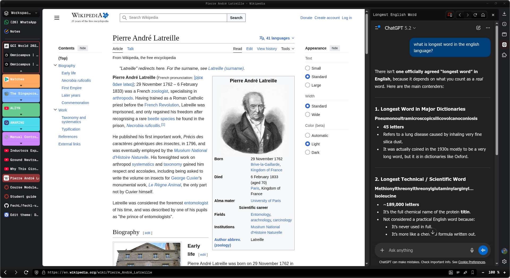

# 🎨 Vivaldi Dark Minimal Theme for Linux

A modern, sleek, and dark-themed customization for **Vivaldi Browser** on Linux. This theme transforms your browsing experience with a clean, minimal interface featuring smooth gradients, rounded corners, and professional typography.

## Installation

Enable Custom CSS in Vivaldi

1. Open Vivaldi and go to `vivaldi://experiments/`
2. Enable **"Allow for using CSS modifications"**
3. Restart Vivaldi

Install Custom CSS

1. Copy the `vivaldi.css` file from the `custom-css/` folder
2. Create a new folder in your profile directory (or use an existing one)
3. Place the CSS file there
4. In Vivaldi Settings → Appearance → Custom UI Modifications, point to the folder containing `vivaldi.css`

Install Theme

1. Extract `theme/theme.zip`
2. Import the theme settings in Vivaldi Settings → Themes → Import Theme

Install Geist Mono Font

For the best experience, install the **Geist Mono** font at [Google Fonts](https://fonts.google.com/specimen/Geist+Mono).
